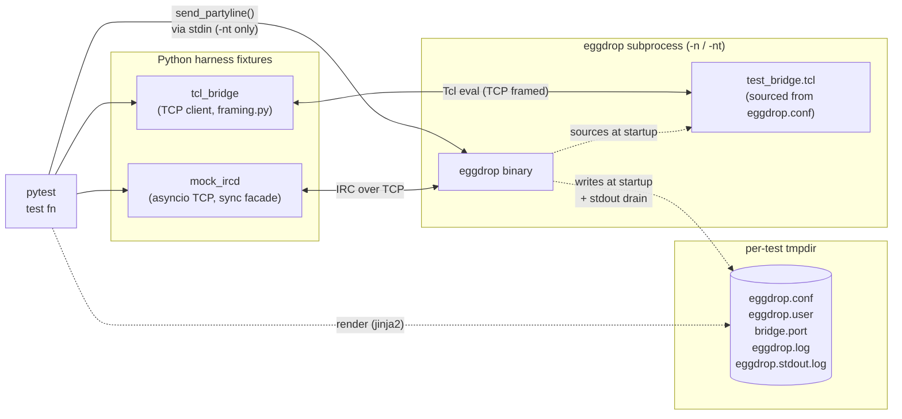

# Eggdrop integration tests

Pytest harness for spawning the real Eggdrop binary against a mock IRCd
and asserting on its internal state. Lives outside `src/` so it adds zero
risk to the bot itself: nothing here changes Eggdrop's source.

## Quick start

The fastest way from a fresh clone to a green suite, with coverage
instrumentation enabled:

```sh
make test                            # distclean, configure --enable-coverage,
                                     # make config, make debug, pytest
```

The `test` target lives in the top-level `Makefile`. It rebuilds from
scratch every time, so it's the right entry point for CI or for verifying
a clean state. For a faster inner-loop while developing tests, build once
and re-run pytest directly:

```sh
make                                 # build eggdrop in the repo root
cd tests
uv sync                              # set up .venv from pyproject.toml (one-time)
uv run pytest                        # run the suite
uv run pytest -v -k partyline        # run a subset
```

`uv tool run ruff check .` and `uv tool run ty check .` should both report
clean. CI runs them.

## Architectural approach



Three loops in play:

1. **Mock IRCd** speaks RFC 1459 + IRCv3 CAP just well enough for Eggdrop to
   register, join, and exchange messages. Async internally; sync API for tests
   (`mock_ircd.recv()`, `.send_welcome()`, `.expect_recv_match()`).
2. **Eggdrop subprocess** runs unmodified. Its `eggdrop.conf` is rendered per
   test from `templates/eggdrop.conf.j2`, points at the mock IRCd's port, and
   sources `support/test_bridge.tcl` when `EGGDROP_TEST=1` is set.
3. **Tcl bridge** is a tiny `socket -server` listener inside Eggdrop that
   takes line-delimited Tcl commands and returns escaped results. The Python
   client (`BridgeClient.eval_ok("...")`) lets a test inspect any internal
   state reachable from the Tcl interpreter — channels, users, settings,
   bind tables, raw variables.

Tests assert on **state** (via the bridge) rather than on text scraped from
logs or partyline output, which is more robust. Logs (`eggdrop.log`,
`eggdrop.stdout.log`) survive in the tmpdir for debugging and are attached
to pytest's failure report.

### Why the bridge instead of `.tcl` over partyline?

The `.tcl` partyline command works but interleaves results with log lines and
mangles multi-line output through `dumplots`. The bridge is a separate
unbuffered channel with explicit framing and no dependence on the partyline
prompt cycle, so introspection is reliable and concurrent with whatever the
partyline is doing.

### Why a real subprocess instead of linking Eggdrop as a library?

To keep changes to Eggdrop at zero. Library-ification of a process built
around `main()` and lots of process-lifetime globals (interp, dcc table,
userlist, channels, modules, signal handlers, OpenSSL, dns child, …) is a
large refactor. Subprocess + bridge gets us regression coverage today and
keeps the door open for a future shared-lib path if it's ever justified.

## Quick start: a test that drives the IRCd and a partyline command

This is `tests/test_partyline_chan.py` (also runnable as
`uv run pytest -k partyline_add`):

```python
import pytest

from support.bridge_client import BridgeClient
from support.eggdrop_proc import EggdropProc
from support.irc_helpers import drive_join_with_names, drive_registration
from support.mock_ircd import MockIrcd
from support.waiters import wait_for


@pytest.mark.partyline                       # ← spawns eggdrop with -nt
def test_partyline_add_channel(
    eggdrop_proc: EggdropProc,
    mock_ircd: MockIrcd,
    tcl_bridge: BridgeClient,
) -> None:
    drive_registration(mock_ircd)            # NICK + USER → welcome
    drive_join_with_names(mock_ircd, "@TestBot")  # JOIN echo + NAMES + WHO + ...

    assert tcl_bridge.eval_ok("llength [channels]") == "1"

    eggdrop_proc.send_partyline(".+chan #pytest")

    wait_for(
        lambda: tcl_bridge.eval_ok(
            'expr {[lsearch [channels] "#pytest"] >= 0}'
        ) == "1",
        timeout=5.0,
        description="partyline .+chan #pytest to register",
    )
```

What this exercises:

1. **IRCd dialogue**: TCP connect → CAP/NICK/USER (auto-handled) → welcome
   → JOIN → NAMES → bot's post-join MODE/WHO queries serviced. The mock
   IRCd auto-PONGs and auto-handles `CAP LS`; the helpers drive the rest.
2. **Partyline command**: `eggdrop_proc.send_partyline(".+chan #pytest")`
   writes to Eggdrop's stdin. The `@pytest.mark.partyline` marker tells the
   `eggdrop_proc` fixture to spawn with `-nt` instead of `-n`, opening the
   HQ partyline on stdin. The HQ user (`-HQ`) gets full owner perms
   automatically — no auth handshake.
3. **State assertion via bridge**: `wait_for(...)` polls
   `tcl_bridge.eval_ok(...)` until the Tcl side reports the new channel.
   Polling is needed because `.+chan` runs through Eggdrop's event loop
   asynchronously from the stdin write; `wait_for` has an explicit timeout
   instead of `time.sleep()`.

## Helpers

Shared utilities for things tests would otherwise hand-roll. Each lives in
its own module under `support/`; add a new module here (and a new
subsection below) when something doesn't fit an existing one.

### IRC dialogue (`support/irc_helpers.py`)

Shared multi-step IRC interactions so tests don't repeat boilerplate.

#### `drive_registration(mock_ircd, nick="TestBot", isupport_tokens=None)`

Drives Eggdrop through IRC registration:

1. Waits for the bot's TCP connect.
2. Drains the bot's `NICK` and `USER` (in either order).
3. Sends the welcome sequence (001-004, optional 005 with
   `isupport_tokens`, 376 end-of-MOTD).

`isupport_tokens` is a list of raw `KEY=VALUE` (or bare `KEY`) strings
that go into a single 005 line. Use this to test parsing of specific
tokens, e.g.:

```python
drive_registration(mock_ircd, isupport_tokens=[
    "PREFIX=(qaohv)~&@%+",
    "CHANMODES=beI,kLf,l,psmntirzMQNRTOVKDdGPZSCc",
])
```

To influence which IRCv3 caps the bot negotiates, override the
`mock_ircd` fixture for the test and construct the IRCd with the cap
list. The bot sends `CAP LS 302` the moment TCP connects, before the
test body runs, so the cap list has to be set at construction time:

```python
@pytest.fixture
def mock_ircd():
    ircd = MockIrcd(advertised_caps=["account-tag"]).start()
    try:
        yield ircd
    finally:
        with contextlib.suppress(Exception):
            ircd.stop()

def test_account_tag_negotiated(eggdrop_proc, mock_ircd, tcl_bridge):
    drive_registration(mock_ircd)
    assert "account-tag" in tcl_bridge.eval_ok("cap enabled").split()
```

The bot only `REQ`s caps it has enabled in config (e.g. `account-tag`
is opt-in via `set account-tag 1` in the rendered eggdrop.conf — pass
`extra_tcl="set account-tag 1\n"` to `eggdrop_config.render`).

After this returns, Eggdrop has processed 005 and is about to JOIN
configured channels.

#### `drive_join_with_names(mock_ircd, members_with_prefix, nick="TestBot", server="mock.test", member_accounts=None) -> str`

Mimics a real IRCd's full post-JOIN dance for the bot:

1. Waits for the bot's `JOIN #chan`.
2. Echoes `:nick!u@h JOIN :#chan` back so Eggdrop populates `chan->name`
   and considers itself joined.
3. Sends `353` NAMES with `members_with_prefix` (a NAMES-style string
   like `"@TestBot ~bigboss +regular"`) and `366` end-of-NAMES.
4. Drains the post-join queries Eggdrop fires off:
   - `MODE +b/+e/+I` → empty `368/349/347` end-of-list replies
   - `WHO #chan ...` → if the bot sent a WHOX-style request (the
     `c%chnufat,222` form, used when `WHOX` ISUPPORT is on), reply with
     one `354` per member carrying the per-member account from
     `member_accounts` (default `*` = not logged in). Otherwise reply
     with one `352` per member (prefix symbols passed through to the WHO
     flags field, so `opchars`-based op detection picks them up). Either
     form ends with `315`.
5. Leaves `MODE #chan` (no list flag) **unanswered** so individual tests
   can send their own `324` mode reply if they need to.

`member_accounts` is a `dict[str, str]` mapping member nick → account
name. Only consulted on the WHOX path; ignored for plain WHO.

Returns the channel name. Quiesces when no new lines arrive for ~300 ms
(or after a 5 s hard cap).

```python
chan = drive_join_with_names(mock_ircd, "@TestBot alice +bob")
# bot is now fully joined to chan; alice is a plain member, bob is voiced
mock_ircd.send(f":mock.test 324 TestBot {chan} +ntk secret")  # custom 324

# WHOX flavour (bot is on a network that advertised WHOX in 005):
chan = drive_join_with_names(
    mock_ircd, "@op alice", member_accounts={"op": "op"}
)
# op's account is now "op" via 354 → got354 → setaccount
```

#### `wait_for_isupport(bridge, key, expected, timeout=5.0)`

Polls `isupport get <key>` over the bridge until it returns `expected`.
Useful right after `drive_registration(..., isupport_tokens=...)` to
ensure Eggdrop has finished processing 005 before assertions run.

```python
wait_for_isupport(tcl_bridge, "PREFIX", "(qaohv)~&@%+")
```

#### `split_member_prefix(token) -> (nick, prefix_symbols)`

Tiny helper used internally by `drive_join_with_names`; exposed for
test code that needs to do the same parsing. `"@alice"` → `("alice", "@")`,
`"~&boss"` → `("boss", "~&")`, `"plain"` → `("plain", "")`.

### Ident responder (`support/identd.py`)

Test-time RFC 1413 ident server, bound to `127.0.0.1:1113`. Used by tests
that exercise the inbound DCC/telnet ident lookup path in
`src/dcc.c:dcc_telnet_hostresolved2`. Eggdrop normally queries TCP/113,
which is privileged; when the spawn env has `EGGDROP_TEST=1` the bot
connects to `1113` instead (see the lazy `getenv` in
`dcc_telnet_hostresolved2`), so the test process doesn't need root or
`CAP_NET_BIND_SERVICE`.

```python
from support.identd import IdentServer

# Reply with USERID — exercises the happy-path parse in dcc_ident.
with IdentServer("respond", user="alice"):
    ...  # open inbound DCC; bot resolves host as alice@<peer>

# Accept then hold; eggdrop's identtimeout eventually fires.
with IdentServer("timeout"):
    ...  # bot resolves host as telnet@<peer> after identtimeout
```

To exercise the **connection-refused** path, just *don't* construct one
— with nothing listening on 1113 the kernel returns RST, and the bot
resolves the host as `telnet@<peer>` immediately. See
`tests/test_ident_scenarios.py` for the full three-modes × two-timeouts
matrix.

Caveat: eggdrop's `check_expired_dcc` only runs every 10s
(`src/main.c:556`), so the effective wait for the timeout case is
`identtimeout + up-to-10s`, not exactly `identtimeout`. Tests waiting on
the ident timeout need a poll window of roughly `identtimeout + 12s`.

## Fixtures

| Fixture | Scope | What you get |
| --- | --- | --- |
| `tmp_eggdir` | function | `Path` to per-test scratch dir (alias of `tmp_path`) |
| `mock_ircd` | function | Started `MockIrcd` listening on `127.0.0.1:0` |
| `eggdrop_config` | function | `EggdropConfig` with `.render(**overrides)` to customise the conf |
| `eggdrop_proc` | function | Spawned `EggdropProc`. `-nt` if test has `@pytest.mark.partyline` |
| `tcl_bridge` | function | Connected `BridgeClient` ready for `.eval_ok("...")` |
| `_process_tracker` | session, autouse | Backstop kill of any leaked eggdrop pids |

The fixtures wire to each other: pulling in `tcl_bridge` is enough — it
depends on `eggdrop_proc` which depends on `eggdrop_config` and
`mock_ircd`, all of which depend on `tmp_eggdir`.

### Markers

| Marker | Effect |
| --- | --- |
| `@pytest.mark.partyline` | `eggdrop_proc` spawns with `-nt`; HQ partyline available on stdin |
| `@pytest.mark.slow` | Tag for end-to-end / reconnect / timeout-driven tests |

## Customising a test's eggdrop.conf

Render with overrides before the proc starts:

```python
def test_with_custom_nick(eggdrop_config, eggdrop_proc, mock_ircd, tcl_bridge):
    eggdrop_config.render(
        nick="OtherBot",
        channels=[
            {"name": "#a", "chanmode": "+nt"},
            {"name": "#b", "chanmode": "+ntk", "key": "secret"},
        ],
        extra_tcl="set my-test-var 42\n",
    )
    # ...rest of the test
```

If you don't call `render()`, the `eggdrop_proc` fixture renders with
defaults from `EggdropConfig.context()`.

`render()` only takes effect *before* the proc fixture evaluates. If your
test parameter list pulls in `eggdrop_proc` directly, the proc has already
spawned by the time the test body runs. To customise after the dataclass
exists but before the bot starts, take `eggdrop_config` + `request:
pytest.FixtureRequest`, render, then lazy-load the rest:

```python
def test_loads_my_userfile(eggdrop_config, request: pytest.FixtureRequest):
    eggdrop_config.render(...)
    eggdrop_config.userfile_path.write_text(...)  # tweak files post-render
    proc = request.getfixturevalue("eggdrop_proc")
    bridge = request.getfixturevalue("tcl_bridge")
```

### Pre-populating the userfile

Two template variables (rendered by `templates/userfile.j2`) inject
already-formatted ban-record lines into the userfile that's written
before the bot starts:

- `userfile_ban_lines` — list of strings, written under `*ban - -`.
- `userfile_chan_ban_lines` — dict of `chan-name → list of strings`,
  each list written under `::<chan-name> bans`. The channel must be
  configured before the userfile is read; the default eggdrop.conf
  `channels` list handles this for `#test` automatically (see
  `chanprog.c:452` for the order: conf load → HOOK_REHASH →
  `readuserfile`).

Build the strings with `support.userfile_helpers.format_userfile_ban`,
which takes every field as a required keyword argument (`mask`, `perm`,
`sticky`, `expire`, `added`, `lastactive`, `creator`, `desc`) and
hex-escapes `:` / `\\` in the mask per `src/misc.c:str_escape`. The
template itself is a flat iteration; all formatting lives in Python.

```python
from support.userfile_helpers import format_userfile_ban

eggdrop_config.render(
    userfile_ban_lines=[
        format_userfile_ban(
            mask="a:storedacct", perm=True, sticky=False, expire=0,
            added=1700000000, lastactive=0, creator="owner",
            desc="from disk",
        ),
    ],
    userfile_chan_ban_lines={
        "#test": [
            format_userfile_ban(
                mask="~a:chanonlyacct", perm=True, sticky=False, expire=0,
                added=1700000000, lastactive=0, creator="owner",
                desc="per-chan",
            ),
        ],
    },
)
```

The chanfile is rendered from `templates/chanfile.j2`. Pass
`chanfile_channels=[{"name": "#chan", "options": "..."}]` if you need
to register channels at chanfile-load time (rather than via
`channels` in the conf). Default is empty — most tests use the
conf-level `channel add` instead.

### Selecting which modules to load

The `modules` template variable controls the `loadmodule` lines and gates
the server-related conf block (`set net-type`, `server add`, `set
msg-rate`, ...) on whether `server` is in the list. Default is the full
chain needed for IRC behaviour: `["pbkdf2", "channels", "server", "ctcp",
"irc", "console", "notes"]`.

Override to test channels-mod-only scenarios (e.g. behaviour when
server.mod is absent — irc.mod and ctcp.mod will fail to load alongside
since they `module_depend` on server):

```python
eggdrop_config.render(modules=["pbkdf2", "channels", "console", "notes"])
```

`extra_modules` still appends in addition to `modules`, so it's the right
knob for opting into share/transfer/etc. without changing the base list.

## Layout

```
tests/
├── pyproject.toml               # uv project, pytest+ruff+ty config
├── README.md                    # this file
├── conftest.py                  # all fixtures + failure-report hook
├── support/
│   ├── framing.py               # line-delimited \-escaped frame format
│   ├── test_bridge.tcl          # sourced inside Eggdrop, opens TCP listener
│   ├── bridge_client.py         # Python client → eval_ok("...")
│   ├── mock_ircd.py             # asyncio IRCd, sync facade
│   ├── irc_helpers.py           # drive_registration, drive_join_with_names, ...
│   ├── identd.py                # IdentServer — RFC 1413 responder on 127.0.0.1:1113
│   ├── userfile_helpers.py      # format_userfile_ban (escaping per src/misc.c:str_escape)
│   ├── eggdrop_proc.py          # subprocess wrapper, stdout drain, terminate
│   └── waiters.py               # wait_for / wait_for_file / wait_for_log_match
├── templates/
│   ├── eggdrop.conf.j2
│   ├── userfile.j2
│   └── chanfile.j2
└── tests/
    ├── test_framing.py
    ├── test_smoke_connect.py
    ├── test_partyline_chan.py
    ├── test_isupport_modes.py
    ├── test_ident_scenarios.py          # ident lookup refused / timeout / success
    ├── test_tcl_passwdok.py             # ported from eggdrop_tcl_passwdok.bats
    ├── test_tcl_iscmds.py               # ported from eggdrop_tcl_iscmds.bats
    ├── test_tcl_matchattr.py            # ported from eggdrop_tcl_matchattr.bats
    ├── test_tcl_server.py               # ported from eggdrop_tcl_server.bats
    ├── test_tcl_addbot.py               # ported from eggdrop_tcl_addbot.bats
    └── test_chanset_inputvalidation.py  # ported from eggdrop_chanset_inputvalidation.bats
```

## Bridge wire protocol

Telnet-friendly, one frame per line, `\` `\n` `\r` backslash-escaped:

```
$ nc 127.0.0.1 <port>
set ::nick
OK TestBot
expr 2 + 2
OK 4
nosuch
ERR invalid command name "nosuch"
```

Request: `<escaped command>\n`. Response: `OK <escaped result>\n` or
`ERR <escaped result>\n`. The bridge only listens when the spawn env has
`EGGDROP_TEST=1`, so production Eggdrops sourcing the same config skip it.

## Environment knobs

- `EGGDROP_BIN` — absolute path to the eggdrop binary. Default: `<repo>/eggdrop`.
- `EGGDROP_SRC` — absolute path to the eggdrop source tree (for `mod-path`,
  `help-path`, `EGG_LANGDIR`). Default: parent of `tests/`.

## Debugging a failing test

- Each test's runtime files survive at `/tmp/pytest-of-<user>/pytest-current/<nodeid>/`.
  pytest preserves the last 3 sessions automatically.
- Two logs are written:
  - `eggdrop.log` — Eggdrop's own log (raw IRC `[@]` incoming, `[m->]`/`[s->]`
    outgoing, plus messages, channels, output, file ops).
  - `eggdrop.stdout.log` — everything Eggdrop wrote to stdout/stderr.
- On failure, both are attached to the pytest report.
- For verbose live output: `uv run pytest -s --log-cli-level=DEBUG path::to::test`.
- To poke the bridge by hand from a hung test, copy the port out of
  `<tmp>/bridge.port` and `nc 127.0.0.1 <port>`.

## Coverage (gcov / lcov)

Eggdrop's `configure` script has an `--enable-coverage` flag (added for
this test harness, see `aclocal.m4` → `EGG_ENABLE_COVERAGE`). It injects
`--coverage -fPIC -O0 -ggdb3` into `CFLAGS` and `--coverage` into
`LDFLAGS`, so the build emits `.gcno` notes alongside every `.o`, and
each spawned process drops `.gcda` runtime data when it exits.

### Build with coverage

The top-level `make test` target does the full build + run cycle:

```sh
make test                            # = distclean → configure --enable-coverage
                                     #   → make config → make debug → pytest
```

Or do it by hand if you want to control the steps:

```sh
make distclean
./configure --enable-coverage
make config
make debug
```

`config.log` will note `enabling gcov coverage instrumentation: --coverage
-fPIC -O0 -ggdb3` and `src/Makefile` will have the flags wired into
`CFLAGS`/`LDFLAGS`. After `make debug`, every `.o` has a `.gcno` next to it
in the same directory.

### Run the suite to populate `.gcda`

```sh
cd tests
uv run pytest                       # each spawned Eggdrop writes .gcda on exit
```

`.gcda` files land beside the corresponding `.gcno`/`.o`. One full suite
run produces ~30+ `.gcda` files across `src/` and `src/mod/*/`. To reset
between runs (without rebuilding) just delete the data:

```sh
find . -name '*.gcda' -delete       # keeps .gcno (build state) in place
```

`make clean` removes both `.gcno` and `.gcda` everywhere as a side
effect; you'd then need to rebuild before the next coverage run.

### Inspect coverage

Per-file:

```sh
gcov -o src/mod/server.mod src/mod/server.mod/server.c
# → server.c.gcov; first line reports "Lines executed: NN.NN% of N"
```

Whole-tree HTML with `lcov`:

```sh
lcov --capture --directory . --output-file cov.info
genhtml cov.info --output-directory cov-html
xdg-open cov-html/index.html
```

### Notes

- Coverage builds are **not** for production — `-O0` plus instrumentation
  is slow, and `.gcda` files accumulate in the source tree (until you
  reset them with `find . -name '*.gcda' -delete` or `make clean`).
- If you change source files between runs without rebuilding,
  `.gcda`/`.gcno` go out of sync and `gcov` will refuse the data. Re-run
  `make debug` after every source change, or delete the stale `.gcda`s.
- Each Eggdrop process writes its `.gcda`s on clean exit. Tests that kill
  the bot with `SIGKILL` (only happens after `SIGTERM` times out) will
  miss data from that process; the harness uses `bridge.eval("die ...")`
  / `SIGTERM` first so this is rare.

## Why some things are the way they are

- **`mod-path` set before `loadmodule`.** Eggdrop reads `mod-path` at each
  `loadmodule` call, not lazily, so the template orders them accordingly.
- **`loadmodule pbkdf2` first.** The userfile read enforces that the
  encryption module is present (src/main.c:1076).
- **`EGG_LANGDIR` env var.** Avoids a symlink in every tmpdir; the language
  files load from the source tree directly.
- **`set msg-rate 0`.** Combined with eggdrop's one-msg-per-second
  `HOOK_SECONDLY` dequeue, this keeps tests fast without altering
  protocol semantics. WHOIS still goes out before JOIN; tests use
  `mock_ircd.drain_until(lambda l: l.startswith("JOIN "))` rather than
  `expect_recv_match` to skip past it.
- **Bridge socket vs `.tcl` over partyline.** The bridge has clean framing
  and no log interleaving; the partyline is for tests of the partyline UX.
- **No `time.sleep` in tests.** Use `waiters.wait_for(...)` /
  `wait_for_file(...)` / `mock_ircd.drain_until(...)` — every wait has an
  explicit timeout and a description.

## Converted from the legacy `eggdrop-tests/` BATS suite

The 6 Tcl-only `.bats` files from the legacy suite have been ported into
this framework. The original ran `cmd_accept.tcl` (a precursor to
`test_bridge.tcl`) on TCP port 45678 and asserted on `nc localhost 45678`
output — exactly the same shape as `tcl_bridge.eval_ok()`, so the
mapping is line-for-line.

| Legacy `.bats` file | New file | Notes |
| --- | --- | --- |
| `eggdrop_tcl_passwdok.bats` | `tests/test_tcl_passwdok.py` | 6 tests |
| `eggdrop_tcl_iscmds.bats` | `tests/test_tcl_iscmds.py` | 22 tests (isban / isbansticky / isexempt / isinvite) |
| `eggdrop_tcl_matchattr.bats` | `tests/test_tcl_matchattr.py` | 23 tests; the 3 "rejects unknown flag" cases now document the new silent-accept behavior since `tcl_matchattr` no longer errors on unknown flags |
| `eggdrop_tcl_server.bats` | `tests/test_tcl_server.py` | 13 tests; ported from the old `addserver`/`delserver`/`set servers` API to the current `server add` / `server remove` / `server list` |
| `eggdrop_tcl_addbot.bats` | `tests/test_tcl_addbot.py` | 13 tests; the 8 IPv6 cases auto-skip via an `ipv6_required` fixture when Eggdrop is built without IPv6 |
| `eggdrop_chanset_inputvalidation.bats` | `tests/test_chanset_inputvalidation.py` | 9 tests for `flood-deop X:Y` parsing |

Files that were **not** converted, with reasons:

- `eggdrop_botnet_linking.bats`, `eggdrop_botnet_partyline.bats` — need
  multiple bots talking to each other; no multi-bot fixture in this
  framework yet.
- `eggdrop_ssl_config.bats`, `eggdrop_ssl_sni.bats` — SSL/TLS not modeled
  in the mock IRCd.
- `eggdrop_compile_*.bats` (5 files) — build-system tests, unrelated to
  runtime behavior. The `make test` target replaces what the
  `eggdrop_compile_testrun.bats` covered.
- `eggdrop_partyline_bans.bats`, `eggdrop_partyline_flags.bats`,
  `eggdrop_console_flags.bats` — drive partyline commands and assert on
  textual output through a TCP partyline (port 1111/3015 in the legacy
  conf). Convertible using the existing `@pytest.mark.partyline` marker
  and `eggdrop_proc.send_partyline()`, but those tests assert on
  free-form output strings; preferring to land them as state-checking
  tests via `tcl_bridge` when possible. Deferred.

## What's intentionally out of scope (for now)

- Linking eggdrop as a shared library / refactoring globals out.
- C-side test hooks; everything stays in Tcl/Python.
- SSL/TLS to the mock IRCd. Plain TCP only.
- Botnet (`share`, `transfer` modules), DCC chat over TCP, Python module.
- Real passwords. The owner in the userfile uses `pass = "-"` (no auth);
  the bridge bypasses the need for it. Partyline auth tests are deferred
  until there's a reason for them.
